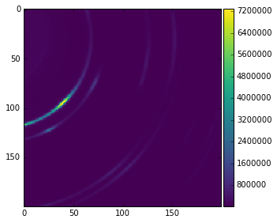
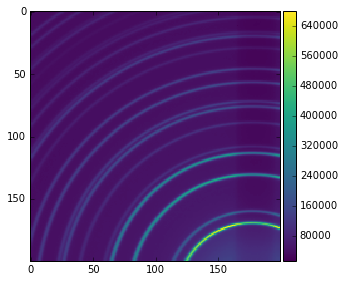

# hackathon
learning powder data

mnist_cnn.py is a simple case of handwriting text recognization script. It is from Keras package. We need to add training data set for the current case. 
If you want to test it, you need to install Theano and Keras. It is better to run it on GPU. 

# Goals
* Classify images from a X-ray powder diffraction as "textured" or "standard"

# Datasets
* Ni (add details)
* Other dataset (add details)
* Can we make these available?

# Methodology
* Manually label datasets as "textured" or "standard"
* Crop images to size (a x b - add details)
* Split each image into quarters
* Normalize image intensity (add methodology)
* Assemble dataset 
* ...
* Resample training and test set to equally weight class samples
* Split dataset into training and test sets (did we use CV?)
* Train CNN model with training set (implemented via Keras)
* Test CNN model on test set 

# Example Images for Classification
* Currently trained classes ["Textured", "Standard"]

| Textured        | Standard           |
| :-------------: |:--------------------:|
|      |  |

# Possible Next Steps
* Gather more diverse training datasets (i.e. across more materials and outcome classes 
* Generate more robust training dataset by adding displacements to images
* Extend to classification of more image types for powder diffraction ["textured","standard","spotty","undersampled"] (need more data for this)
* Investigate generalization of this methodology to other beamline datasets
* Identify use cases where machine vision could be used to automatically add metadata to 
* Notification service to analyze a stream of images and alert a researcher when a change has occured (e.g., user subscribes to be notified if images coming from a running experiment transition from "standard" to "textured"
* ...

